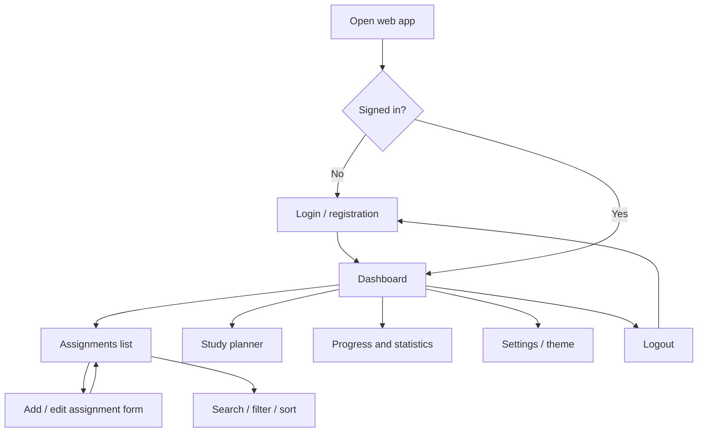

# Web application screen flow

```mermaid
flowchart TD
  A[Open web app] --> B{Signed in?}
  B -- No --> C[Login / registration]
  C --> D[Dashboard]
  B -- Yes --> D
  D --> E[Assignments list]
  E --> F[Add / edit assignment form]
  F --> E
  E --> G[Search / filter / sort]
  D --> H[Study planner]
  D --> I[Progress and statistics]
  D --> J[Settings / theme]
  D --> K[Logout]
  K --> C
```

This flow documents the web application; it is not an Android/iOS emulator flow.
